# WebUI screenshot gallery

Every view in the app, captured with Playwright (Chromium) against a copy of
`examples/server-config.yaml` via `scripts/playwright-ui-server.ts` — the same
server the WebUI self-tests use. No Discord credentials involved.

| View | Canvas |
|------|--------|
| Desktop | 1600 × 900 @2x |
| Phone | Pixel 5 (393 × 851) @2x |
| Tablet | 834 × 1194 @2x |
| Ultra-wide | 2560 × 1080 @1x |

## Desktop (four-pane builder)

| | |
|---|---|
| 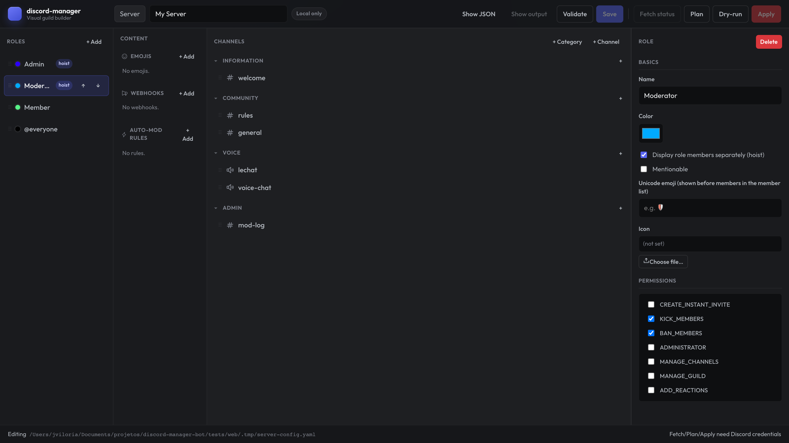 | 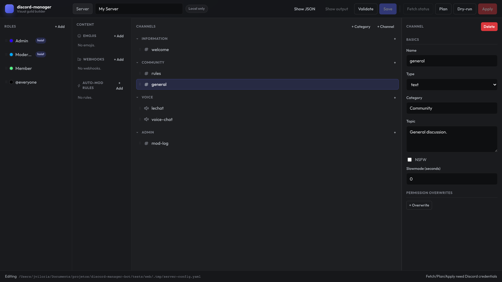 |
| Roles rail — role selected: color, hoist, mentionable, permissions, unicode emoji, icon | Channel selected — name, topic, NSFW, rate limit, and the permission-overwrites editor |
| 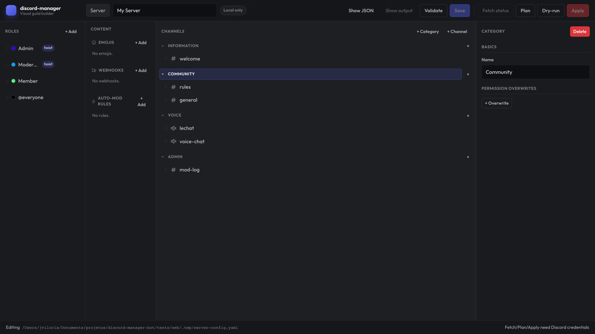 | 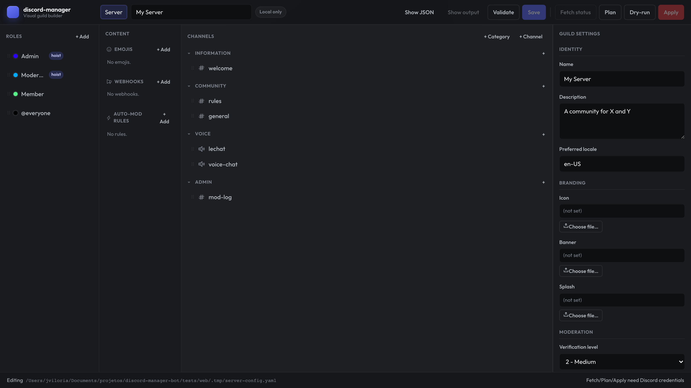 |
| Category selected | Guild settings — name, description, locale, icon / banner / splash, verification level, … |
| 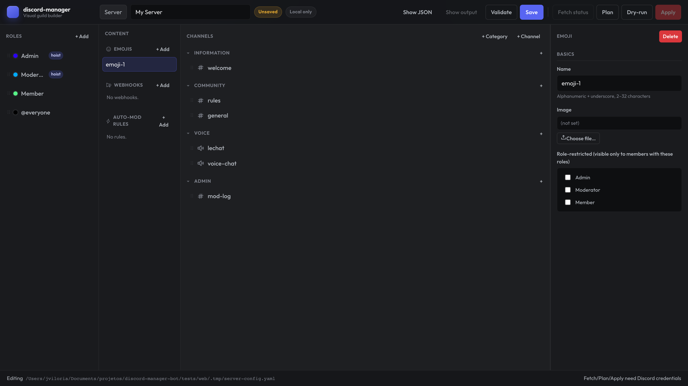 | 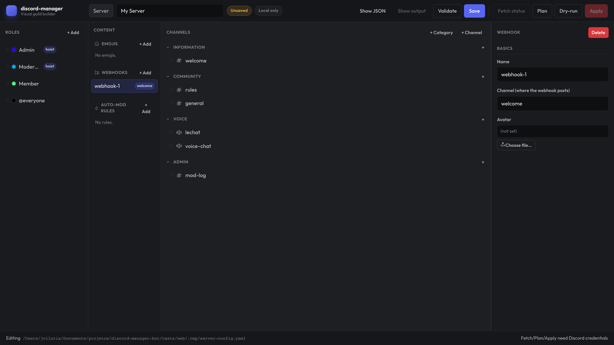 |
| Content pane — emoji form (name, image via asset picker, role restrictions) | Content pane — webhook form (name, channel, avatar) |
| 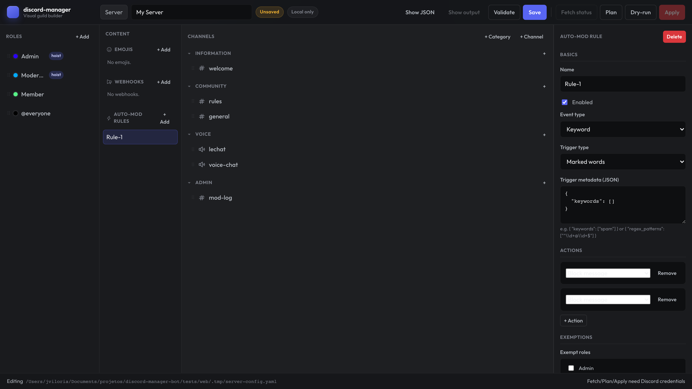 | 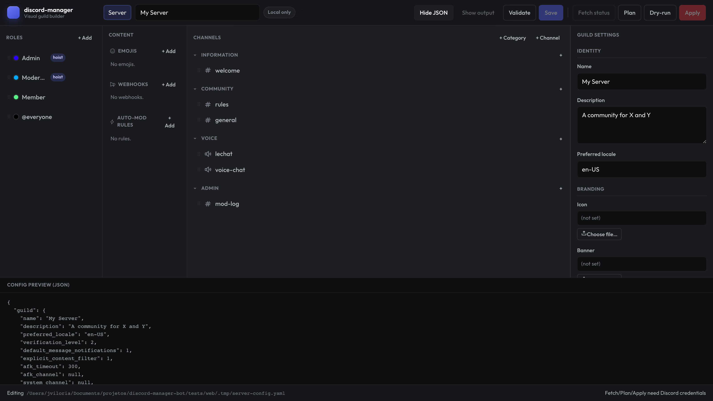 |
| Content pane — auto-mod rule with per-type action cards | Raw JSON preview ("Show JSON" toggle) |

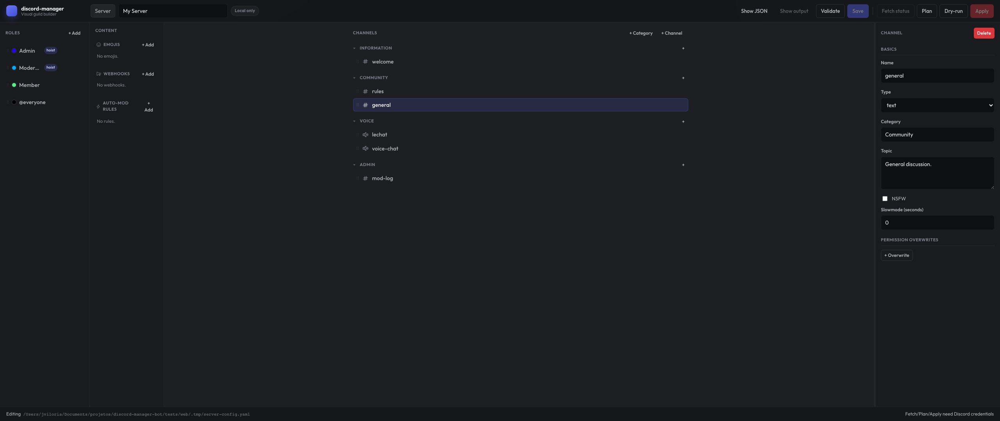

*Ultra-wide (≥1800 px): sidebars stay edge-anchored while the center channel list is width-capped.*

## Phone (bottom tabs: Roles / Channels / Content / Edit)

| | |
|---|---|
| 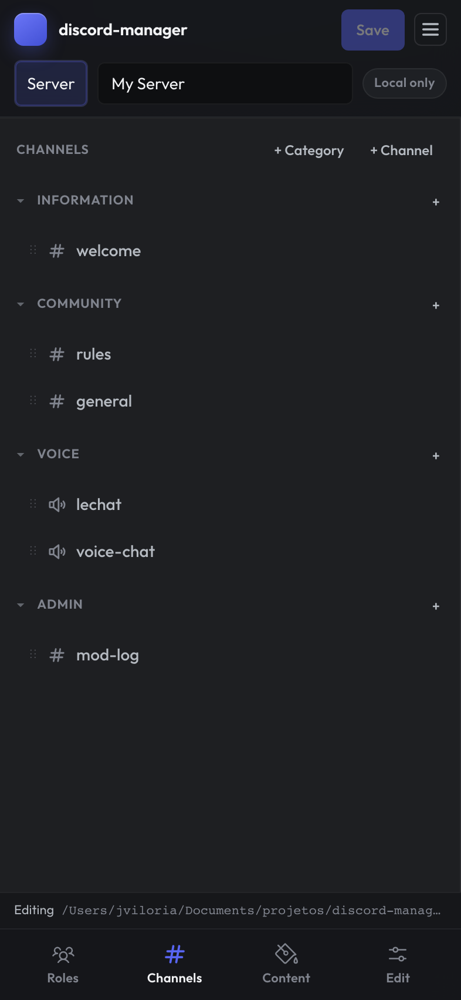 | 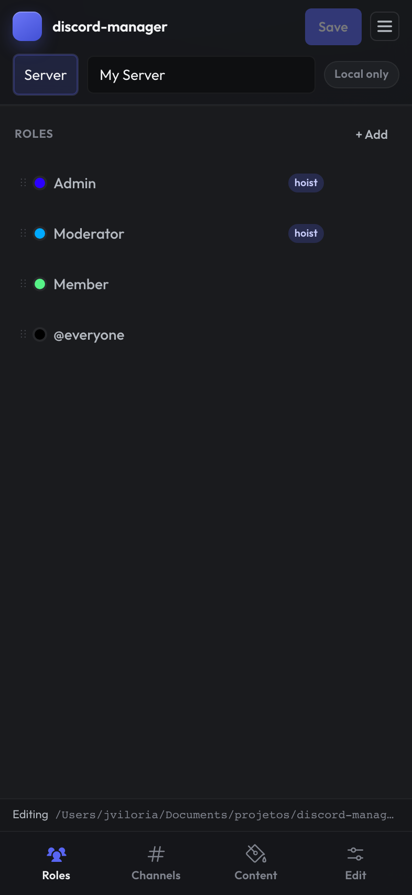 |
| Channels tab | Roles tab |
| 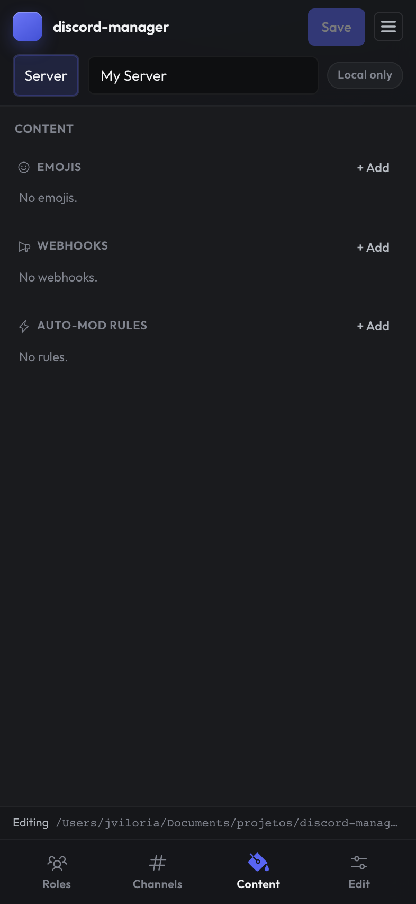 | 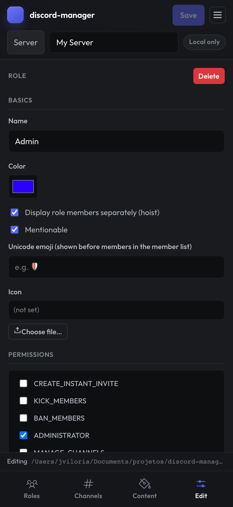 |
| Content tab (emojis / webhooks / auto-mod) | Edit tab — role selected |

## Tablet (channels front-and-center, slide-over drawers)

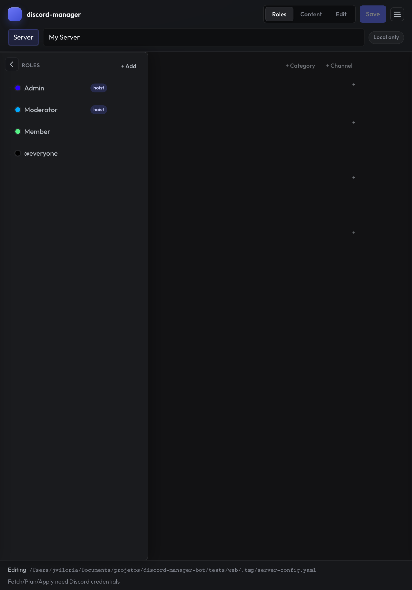

*Tablet — Roles slide-over drawer open over the channel tree.*
